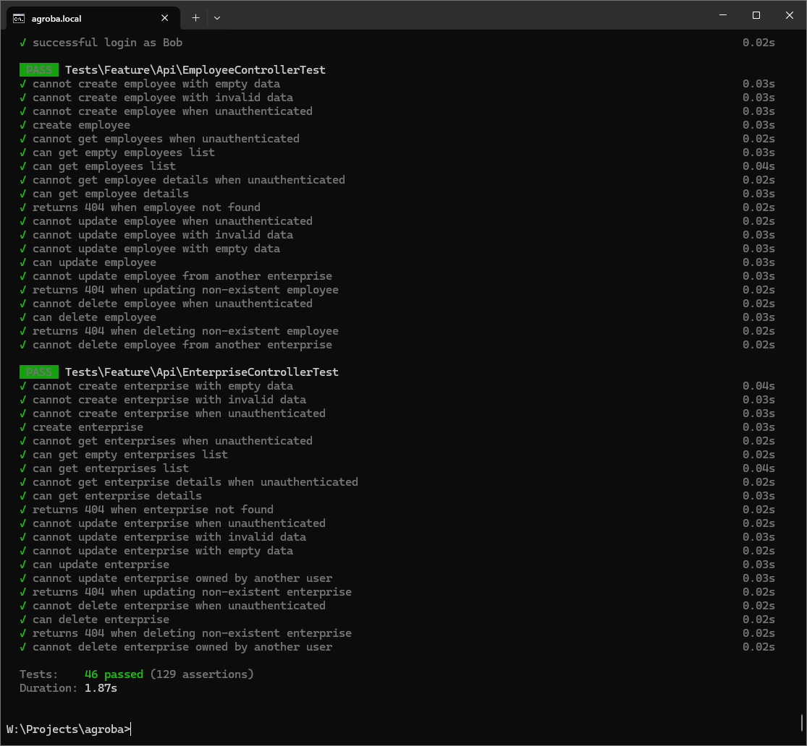
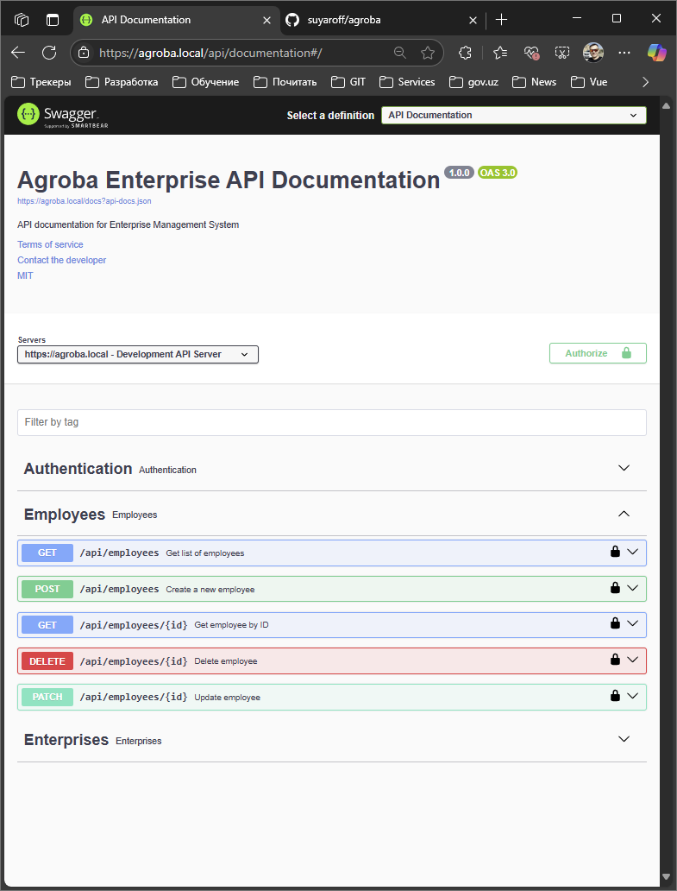

# Agroba

## Overview

Agroba is a test task for creating a backend API that manages enterprises and their employees. 
See detailed requirements in [TASK.md](TASK.md).

## See on youtube
https://www.youtube.com/watch?v=WGaVFkJKg3E

## Features
- MVC architecture, with separate controllers and route files.
- SQLite database for lightweight storage.
- RESTful routes.
- Token-based authentication (Laravel Sanctum integration).
- APIs and Swagger documentation for easy integration.

## Project Structure
- **app/Http/Controllers**: Contains application controllers such as `HomeController`.
- **routes/web.php**: Main routes for web requests.
- **routes/api.php**: Routes for API.
- **database/**: Database structure and migrations.
- **resources/**: Contains front-end views and assets.

## Requirements
- PHP >= 8.2
- Composer

## Installation

Follow these steps to set up Agroba locally:

1. **Clone the Repository**
   ```bash
   git clone https://github.com/suyaroff/agroba.git
   cd agroba
   ```

2. **Install Dependencies**
   - PHP dependencies:
     ```bash
     composer install
     ```

3. **Setup Environment**
   - if .env does not exist, copy the environment template :
     ```bash
     cp .env.example .env
     ```
   - Configure `.env` according to your setup (e.g., database settings).


4. **Database Migration**
   ```bash
   php artisan migrate --seed
   ```

5. **Generate Application Key**
   ```bash
   php artisan key:generate
   ```

6. **Run Application**
   - Start the backend server:
     ```bash
     php artisan serve
     ```


## Routes Overview
### Web Routes (`web.php`)
- `/`: Home Page (handled by `HomeController@index`).
- `/terms`: Terms and Conditions Page (handled by `HomeController@terms`).

### API Routes (`api.php`)
Further API-based functionality is to be confirmed based on the `Api` directory structure.

| Method    | Route                         | Handler                                         | Description                   |
|-----------|-------------------------------|-------------------------------------------------|-------------------------------|
| POST      | /api/auth/login               | Api\AuthController@login                        | User authentication endpoint  |
| POST      | /api/auth/logout              | Api\AuthController@logout                       | Logout authenticated user     |
| POST      | /api/auth/me                  | Api\AuthController@me                           | Get current user info         |
| POST      | /api/auth/refresh             | Api\AuthController@refresh                      | Refresh authentication token  |
| GET       | /api/documentation            | L5Swagger\Http\SwaggerController@api            | API documentation             |
| GET       | /api/employees                | Api\EmployeeController@index                    | List all employees            |
| POST      | /api/employees                | Api\EmployeeController@store                    | Create new employee           |
| GET       | /api/employees/{employee}     | Api\EmployeeController@show                     | Get single employee details   |
| PUT/PATCH | /api/employees/{employee}     | Api\EmployeeController@update                   | Update employee info          |
| DELETE    | /api/employees/{employee}     | Api\EmployeeController@destroy                  | Delete employee               |
| GET       | /api/enterprises              | Api\EnterpriseController@index                  | List all enterprises          |
| POST      | /api/enterprises              | Api\EnterpriseController@store                  | Create new enterprise         |
| GET       | /api/enterprises/{enterprise} | Api\EnterpriseController@show                   | Get single enterprise details |
| PUT/PATCH | /api/enterprises/{enterprise} | Api\EnterpriseController@update                 | Update enterprise info        |
| DELETE    | /api/enterprises/{enterprise} | Api\EnterpriseController@destroy                | Delete enterprise             |
| GET       | /api/oauth2-callback          | L5Swagger\Http\SwaggerController@oauth2Callback | OAuth2 callback handler       |
| GET       | /api/user                     | -                                               | Get authenticated user data   |
| GET       | docs                          | L5Swagger\Http\SwaggerController@docs           | API documentation page        |
| GET       | docs/asset/{asset}            | L5Swagger\Http\SwaggerAssetController@index     | Documentation assets          |
| GET       | sanctum/csrf-cookie           | Laravel\Sanctum\CsrfCookieController@show       | Get CSRF cookie               |
| GET       | terms                         | HomeController@terms                            | Terms and conditions page     |
| GET       | up                            | -                                               | Application health check      |

## Development Features
- **Testing**: Laravel supports PHPUnit and Pest for testing.
- Run tests:
  ```bash
  php artisan test
  ```


## Swagger

Static Documentation**: Swagger documentation is maintained for APIs. https://agroba.local/api/documentation



## Postman

A Postman collection is available in the repository (`Agroba.postman_collection.json`) that includes all API endpoints
with example requests. The collection provides:

- Pre-configured environment variables {{host}} {{token}}
- Authentication requests
- Enterprise management endpoints
- Employee management endpoints
- Auth operations
- Documentation

Import the collection into Postman to test the API endpoints quickly.

## Contributing
Feel free to contribute to this project. Submit pull requests, create issues, or suggest improvements.

## License

This project is open-source. MIT License.

---

